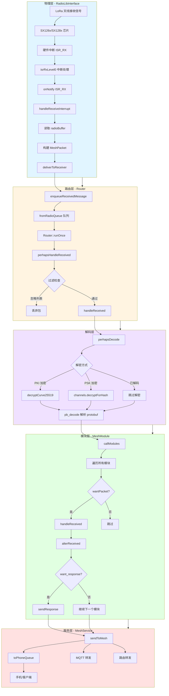
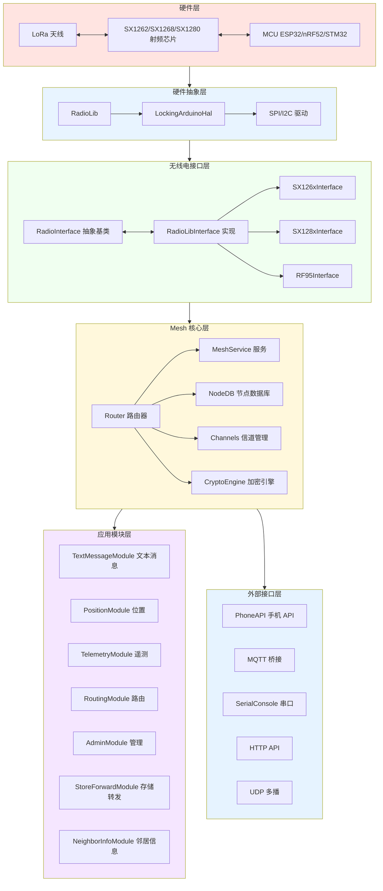
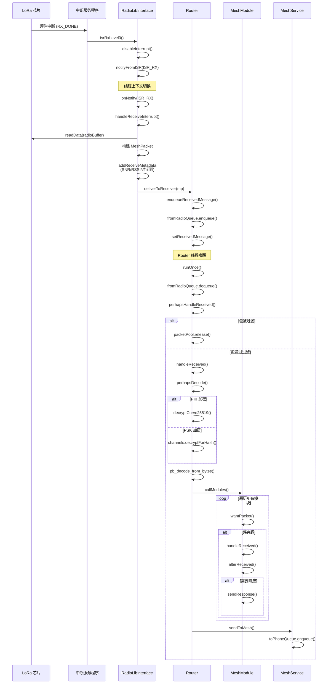
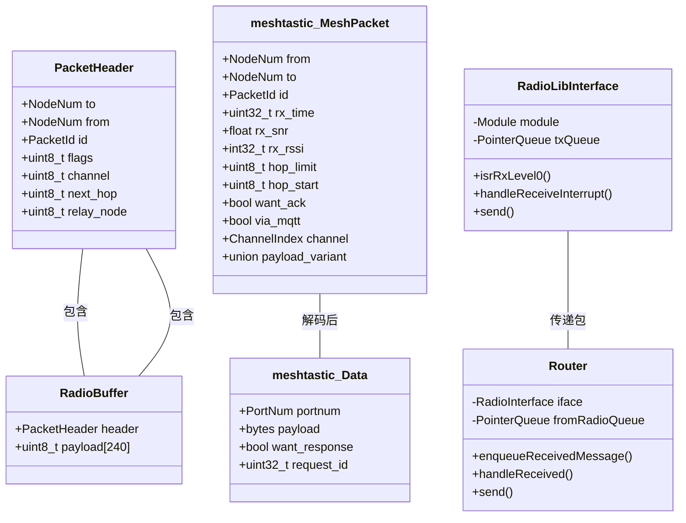
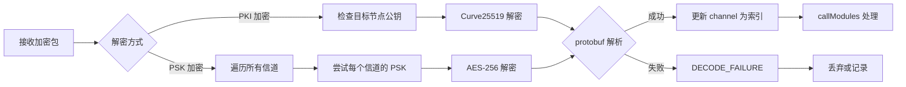

# Meshtastic LoRa 数据接收流程分析

## 📊 数据流向总览

## 🏗️ 系统架构框架图

## 🔄 接收中断处理详细流程

## 📦 关键数据结构

## 📍 关键代码位置

| 功能 | 文件 | 关键函数 |
|------|------|----------|
| 中断处理 | `RadioLibInterface.cpp` | `isrRxLevel0()`, `handleReceiveInterrupt()` |
| 包队列 | `Router.cpp` | `enqueueReceivedMessage()`, `runOnce()` |
| 包过滤 | `Router.cpp` | `perhapsHandleReceived()` |
| 解密解码 | `Router.cpp` | `perhapsDecode()` |
| 模块分发 | `MeshModule.cpp` | `callModules()` |
| 服务分发 | `MeshService.cpp` | `handleFromRadio()`, `sendToPhone()` |

## 🔐 安全处理流程

## 📈 性能优化点

1. **中断快速处理**: ISR 只做最小工作，通知线程处理
2. **零拷贝设计**: 使用内存池分配，避免动态分配
3. **早丢弃策略**: 在解码前过滤无效包
4. **模块链式处理**: 支持模块提前终止处理链
5. **延迟重播**: 基于 SNR 的动态退避机制
