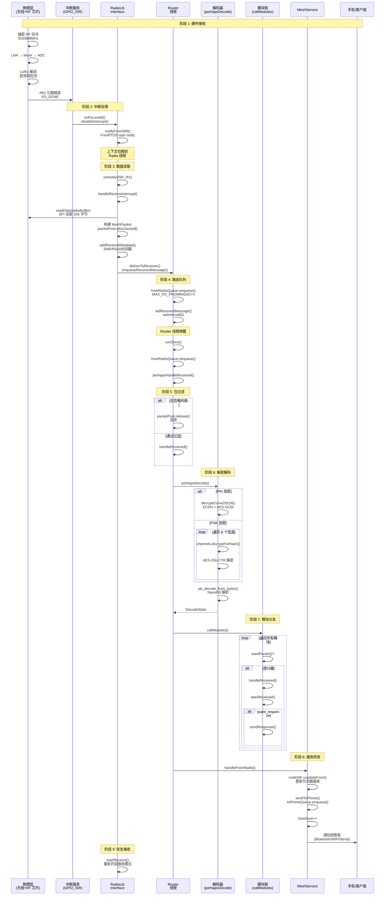

# Meshtastic LoRa 数据接收完整详细流程

> 本文档深入到每一行代码、每一个状态转换、每一次内存分配

---

## 📋 目录

1. [硬件中断层](#1-硬件中断层)
2. [无线电接口层](#2-无线电接口层)
3. [路由队列层](#3-路由队列层)
4. [解码加密层](#4-解码加密层)
5. [模块分发层](#5-模块分发层)
6. [服务转发层](#6-服务转发层)
7. [完整时序图](#7-完整时序图)
8. [内存布局](#8-内存布局)

---

## 1. 硬件中断层

### 1.1 物理接收流程

```
┌─────────────────────────────────────────────────────────────┐
│                     天线捕获 RF 信号                          │
│                     915MHz (US) / 868MHz (EU)                │
└────────────────────┬────────────────────────────────────────┘
                     │ 模拟信号
                     ▼
┌─────────────────────────────────────────────────────────────┐
│                  SX1262/SX1268/SX1280 射频芯片                │
│  ┌───────────────────────────────────────────────────────┐  │
│  │ LNA (低噪声放大器)                                     │  │
│  │ ↓                                                      │  │
│  │ Mixer (混频器) → 中频信号                              │  │
│  │ ↓                                                      │  │
│  │ ADC (模数转换)                                         │  │
│  │ ↓                                                      │  │
│  │ LoRa 解调 (Chirp 解调)                                  │  │
│  │ ↓                                                      │  │
│  │ 前导码检测 → 头部验证 → CRC 校验                         │  │
│  │ ↓                                                      │  │
│  │ RX_DONE 中断触发                                        │  │
│  └───────────────────────────────────────────────────────┘  │
└────────────────────┬────────────────────────────────────────┘
                     │ IRQ 引脚拉高/拉低
                     ▼
┌─────────────────────────────────────────────────────────────┐
│                    MCU GPIO 中断                             │
│              (ESP32: GPIO_ISR_Handler)                      │
└────────────────────┬────────────────────────────────────────┘
```

### 1.2 中断注册代码

**文件**: `src/mesh/RadioLibInterface.cpp`

```cpp
// 第 47-59 行：中断服务程序入口
void INTERRUPT_ATTR RadioLibInterface::isrLevel0Common(PendingISR cause)
{
    instance->disableInterrupt();  // 禁用中断防止重入

    BaseType_t xHigherPriorityTaskWoken;
    // 通知 FreeRTOS 任务
    instance->notifyFromISR(&xHigherPriorityTaskWoken, cause, true);

    /* 如果需要，强制上下文切换 */
    YIELD_FROM_ISR(xHigherPriorityTaskWoken);
}

void INTERRUPT_ATTR RadioLibInterface::isrRxLevel0()
{
    isrLevel0Common(ISR_RX);  // 接收中断
}

void INTERRUPT_ATTR RadioLibInterface::isrTxLevel0()
{
    isrLevel0Common(ISR_TX);  // 发送中断
}
```

**关键点**:
- `INTERRUPT_ATTR`: 确保 ISR 代码在 IRAM 中执行（ESP32）
- `disableInterrupt()`: 防止中断嵌套
- `notifyFromISR()`: 使用 FreeRTOS 的 `xTaskNotifyFromISR()` 唤醒 Radio 线程

### 1.3 硬件抽象层初始化

**文件**: `src/mesh/RadioInterface.cpp`

```cpp
// 第 205-280 行：根据硬件配置初始化不同的射频芯片
std::unique_ptr<RadioInterface> initLoRa()
{
    // ... SPI 配置 ...
    SPISettings loraSpiSettings(4000000, MSBFIRST, SPI_MODE0);
    LockingArduinoHal *loraHal = new LockingArduinoHal(SPI, loraSpiSettings);

    // 按优先级检测芯片
#if defined(USE_SX1262) && RADIOLIB_EXCLUDE_SX126X != 1
    if ((!rIf) && (config.lora.region != meshtastic_Config_LoRaConfig_RegionCode_LORA_24)) {
        auto sxIf = std::unique_ptr<SX1262Interface>(
            new SX1262Interface(loraHal, SX126X_CS, SX126X_DIO1, SX126X_RESET, SX126X_BUSY));
#ifdef SX126X_DIO3_TCXO_VOLTAGE
        sxIf->setTCXOVoltage(SX126X_DIO3_TCXO_VOLTAGE);  // TCXO 电压配置
#endif
        if (!sxIf->init()) {
            LOG_WARN("No SX1262 radio");
            rIf = nullptr;
        } else {
            LOG_INFO("SX1262 init success");
            rIf = std::move(sxIf);
            radioType = SX1262_RADIO;
        }
    }
#endif
    // ... 其他芯片检测 ...
}
```

---

## 2. 无线电接口层

### 2.1 中断处理完整流程

**文件**: `src/mesh/RadioLibInterface.cpp`

```cpp
// 第 273-290 行：onNotify 通知处理
void RadioLibInterface::onNotify(uint32_t notification)
{
    switch (notification) {
    case ISR_RX:  // 接收中断
        handleTransmitInterrupt();  // 先完成可能的发送
        startReceive();             // 重新开启接收
        setTransmitDelay();         // 设置发送延迟
        break;
        
    case ISR_TX:  // 发送中断
        handleTransmitInterrupt();
        startReceive();
        setTransmitDelay();
        break;
        
    case TRANSMIT_DELAY_COMPLETED:  // 延迟计时器到期
        if (!txQueue.empty()) {
            if (!canSendImmediately()) {
                setTransmitDelay();  // 仍在 RX/TX，重置延迟
            } else {
                meshtastic_MeshPacket *txp = txQueue.getFront();
                long delay_remaining = txp->tx_after ? txp->tx_after - millis() : 0;
                if (delay_remaining > 0) {
                    notifyLater(delay_remaining, TRANSMIT_DELAY_COMPLETED, false);
                } else {
                    if (isChannelActive()) {
                        startReceive();  // 先尝试接收
                        setTransmitDelay();
                    } else {
                        txp = txQueue.dequeue();
                        assert(txp);
                        startSend(txp);  // 开始发送
                    }
                }
            }
        }
        break;
    }
}
```

### 2.2 接收中断详细处理

**文件**: `src/mesh/RadioLibInterface.cpp`

```cpp
// 第 419-507 行：handleReceiveInterrupt 完整实现
void RadioLibInterface::handleReceiveInterrupt()
{
    // 状态检查
    if (!isReceiving) {
        LOG_ERROR("handleReceiveInterrupt called when not in rx mode");
        return;
    }

    isReceiving = false;  // 清除接收状态

    // 读取实际接收的字节数
    size_t length = iface->getPacketLength();

    // 计算接收占用时间（用于空口时间统计）
    uint32_t rxMsec = getPacketTime(length, true);

    // 区域检查
#ifndef DISABLE_WELCOME_UNSET
    if (config.lora.region == meshtastic_Config_LoRaConfig_RegionCode_UNSET) {
        LOG_WARN("lora rx disabled: Region unset");
        airTime->logAirtime(RX_ALL_LOG, rxMsec);
        return;
    }
#endif

    // 从射频芯片读取数据到 radioBuffer
    int state = iface->readData((uint8_t *)&radioBuffer, length);
    
    if (state != RADIOLIB_ERR_NONE) {
        // 错误处理
        LOG_ERROR("Ignore received packet due to error=%d", state);
        rxBad++;
        airTime->logAirtime(RX_ALL_LOG, rxMsec);
    } else {
        // 计算 payload 长度
        int32_t payloadLen = length - sizeof(PacketHeader);

        if (payloadLen < 0) {
            LOG_WARN("Ignore received packet too short");
            rxBad++;
            airTime->logAirtime(RX_ALL_LOG, rxMsec);
        } else {
            rxGood++;  // 有效接收计数

            // 安全过滤：from==0 的包可能是伪造的
            if (radioBuffer.header.from == 0) {
                LOG_WARN("Ignore received packet without sender");
                return;
            }

            // 从内存池分配 MeshPacket
            meshtastic_MeshPacket *mp = packetPool.allocZeroed();

            // 填充 PacketHeader 字段
            mp->from = radioBuffer.header.from;
            mp->to = radioBuffer.header.to;
            mp->id = radioBuffer.header.id;
            mp->channel = radioBuffer.header.channel;
            
            // 解析 flags 位域
            mp->hop_limit = radioBuffer.header.flags & PACKET_FLAGS_HOP_LIMIT_MASK;
            mp->hop_start = (radioBuffer.header.flags & PACKET_FLAGS_HOP_START_MASK) 
                            >> PACKET_FLAGS_HOP_START_SHIFT;
            mp->want_ack = !!(radioBuffer.header.flags & PACKET_FLAGS_WANT_ACK_MASK);
            mp->via_mqtt = !!(radioBuffer.header.flags & PACKET_FLAGS_VIA_MQTT_MASK);
            
            // 下一跳和中继节点（仅当 hop_start 设置时有效）
            mp->next_hop = mp->hop_start == 0 ? NO_NEXT_HOP_PREFERENCE 
                                              : radioBuffer.header.next_hop;
            mp->relay_node = mp->hop_start == 0 ? NO_RELAY_NODE 
                                                : radioBuffer.header.relay_node;

            // 添加接收元数据（SNR、RSSI 等）
            addReceiveMetadata(mp);

            // 标记为加密状态（待解码）
            mp->which_payload_variant = meshtastic_MeshPacket_encrypted_tag;
            
            // 复制 payload
            assert(((uint32_t)payloadLen) <= sizeof(mp->encrypted.bytes));
            memcpy(mp->encrypted.bytes, radioBuffer.payload, payloadLen);
            mp->encrypted.size = payloadLen;

            printPacket("Lora RX", mp);

            // 记录空口时间
            airTime->logAirtime(RX_LOG, rxMsec);

            // 传递给 Router
            deliverToReceiver(mp);
        }
    }
}
```

### 2.3 PacketHeader 内存布局

```cpp
// 文件：src/mesh/RadioInterface.h 第 27-44 行
typedef struct {
    NodeNum to, from;        // 4 字节 each (可以是 1 或 4 字节)
    PacketId id;             // 4 字节
    uint8_t flags;           // 1 字节 - 位域定义：
                             //   bits 0-2: hop_limit
                             //   bit 3: want_ack
                             //   bit 4: via_mqtt
                             //   bits 5-7: hop_start
    uint8_t channel;         // 1 字节 - 信道哈希
    uint8_t next_hop;        // 1 字节 - 下一跳节点的最后字节
    uint8_t relay_node;      // 1 字节 - 中继节点的最后字节
} PacketHeader;              // 总计：16 字节 (MESHTASTIC_HEADER_LENGTH)
```

```cpp
// 文件：src/mesh/RadioInterface.h 第 46-54 行
typedef struct {
    PacketHeader header;                                    // 16 字节
    uint8_t payload[MAX_LORA_PAYLOAD_LEN + 1 - sizeof(PacketHeader)] 
        __attribute__((__aligned__));  // 240 字节
} RadioBuffer;                                              // 总计：256 字节
```

---

## 3. 路由队列层

### 3.1 入队操作

**文件**: `src/mesh/Router.cpp`

```cpp
// 第 155-171 行：enqueueReceivedMessage
void Router::enqueueReceivedMessage(meshtastic_MeshPacket *p)
{
    // 循环尝试入队，直到成功
    while (!fromRadioQueue.enqueue(p, 0)) {
        // 队列满时丢弃最旧的包
        meshtastic_MeshPacket *old_p;
        old_p = fromRadioQueue.dequeuePtr(0);
        if (old_p) {
            printPacket("fromRadioQ full, drop oldest!", old_p);
            packetPool.release(old_p);  // 释放回内存池
        }
    }
    // 唤醒 Router 线程
    setReceivedMessage();
}

// 第 178-182 行：唤醒机制
void Router::setReceivedMessage()
{
    setInterval(0);  // 立即运行
    runASAP = true;
}
```

### 3.2 Router 线程循环

**文件**: `src/mesh/Router.cpp`

```cpp
// 第 143-151 行：runOnce 主循环
int32_t Router::runOnce()
{
    meshtastic_MeshPacket *mp;
    // 处理队列中的所有包
    while ((mp = fromRadioQueue.dequeuePtr(0)) != NULL) {
        perhapsHandleReceived(mp);
    }
    return INT32_MAX;  // 进入休眠，等待下次唤醒
}
```

### 3.3 包过滤逻辑

**文件**: `src/mesh/Router.cpp`

```cpp
// 第 772-827 行：perhapsHandleReceived
void Router::perhapsHandleReceived(meshtastic_MeshPacket *p)
{
    // 1. 检查忽略列表
    if (is_in_repeated(config.lora.ignore_incoming, p->from)) {
        LOG_DEBUG("Ignore msg, 0x%x is in our ignore list", p->from);
        packetPool.release(p);
        return;
    }

    // 2. 检查节点是否被忽略
    meshtastic_NodeInfoLite const *node = nodeDB->getMeshNode(p->from);
    if (node != NULL && node->is_ignored) {
        LOG_DEBUG("Ignore msg, 0x%x is ignored", p->from);
        packetPool.release(p);
        return;
    }

    // 3. 过滤广播地址
    if (p->from == NODENUM_BROADCAST) {
        LOG_DEBUG("Ignore msg from broadcast address");
        packetPool.release(p);
        return;
    }

    // 4. 过滤 MQTT 来源（如果配置）
    if (config.lora.ignore_mqtt && p->via_mqtt) {
        LOG_DEBUG("Msg came in via MQTT from 0x%x", p->from);
        packetPool.release(p);
        return;
    }

    // 5. 子类过滤钩子
    if (shouldFilterReceived(p)) {
        LOG_DEBUG("Incoming msg was filtered from 0x%x", p->from);
        packetPool.release(p);
        return;
    }

    // 通过所有过滤，进入处理
    handleReceived(p);
    packetPool.release(p);
}
```

---

## 4. 解码加密层

### 4.1 perhapsDecode 完整实现

**文件**: `src/mesh/Router.cpp`

```cpp
// 第 423-565 行：perhapsDecode
DecodeState perhapsDecode(meshtastic_MeshPacket *p)
{
    concurrency::LockGuard g(cryptLock);  // 加密锁

    // 1. 已知节点过滤（仅 REBROADCAST_MODE_KNOWN_ONLY）
    if (config.device.rebroadcast_mode == meshtastic_Config_DeviceConfig_RebroadcastMode_KNOWN_ONLY &&
        (nodeDB->getMeshNode(p->from) == NULL || !nodeDB->getMeshNode(p->from)->has_user)) {
        LOG_DEBUG("Node 0x%x not in nodeDB-> Rebroadcast mode KNOWN_ONLY will ignore packet", p->from);
        return DecodeState::DECODE_FAILURE;
    }

    // 2. 已解码包直接返回
    if (p->which_payload_variant == meshtastic_MeshPacket_decoded_tag)
        return DecodeState::DECODE_SUCCESS;

    size_t rawSize = p->encrypted.size;
    if (rawSize > sizeof(bytes)) {
        LOG_ERROR("Packet too large to attempt decryption!");
        return DecodeState::DECODE_FATAL;
    }

    bool decrypted = false;
    ChannelIndex chIndex = 0;

#if !(MESHTASTIC_EXCLUDE_PKI)
    // 3. PKI 解密尝试（点对点加密）
    if (p->channel == 0 && isToUs(p) && p->to > 0 && !isBroadcast(p->to) &&
        nodeDB->getMeshNode(p->from) != nullptr &&
        nodeDB->getMeshNode(p->from)->user.public_key.size > 0 &&
        nodeDB->getMeshNode(p->to)->user.public_key.size > 0 &&
        rawSize > MESHTASTIC_PKC_OVERHEAD) {
        
        LOG_DEBUG("Attempt PKI decryption");

        if (crypto->decryptCurve25519(p->from, 
                nodeDB->getMeshNode(p->from)->user.public_key, 
                p->id, rawSize, p->encrypted.bytes, bytes)) {
            
            LOG_INFO("PKI Decryption worked!");

            meshtastic_Data decodedtmp;
            memset(&decodedtmp, 0, sizeof(decodedtmp));
            rawSize -= MESHTASTIC_PKC_OVERHEAD;
            
            if (pb_decode_from_bytes(bytes, rawSize, &meshtastic_Data_msg, &decodedtmp) &&
                decodedtmp.portnum != meshtastic_PortNum_UNKNOWN_APP) {
                
                decrypted = true;
                LOG_INFO("Packet decrypted using PKI!");
                p->pki_encrypted = true;
                memcpy(&p->public_key.bytes, 
                       nodeDB->getMeshNode(p->from)->user.public_key.bytes, 32);
                p->public_key.size = 32;
                p->decoded = decodedtmp;
                p->which_payload_variant = meshtastic_MeshPacket_decoded_tag;
            } else {
                LOG_ERROR("PKC Decrypted, but pb_decode failed!");
                return DecodeState::DECODE_FAILURE;
            }
        } else {
            LOG_WARN("PKC decrypt attempted but failed!");
        }
    }
#endif

    // 4. PSK 解密尝试（信道加密）
    if (!decrypted) {
        // 遍历所有信道尝试解密
        for (chIndex = 0; chIndex < channels.getNumChannels(); chIndex++) {
            if (channels.decryptForHash(chIndex, p->channel)) {
                // 复制加密数据到临时缓冲区
                memcpy(bytes, p->encrypted.bytes, rawSize);
                
                // AES-256 解密
                crypto->decrypt(p->from, p->id, rawSize, bytes);

                // 解析 protobuf
                meshtastic_Data decodedtmp;
                memset(&decodedtmp, 0, sizeof(decodedtmp));
                
                if (!pb_decode_from_bytes(bytes, rawSize, &meshtastic_Data_msg, &decodedtmp)) {
                    LOG_ERROR("Invalid protobufs in received mesh packet id=0x%08x (bad psk?)!", p->id);
                } else if (decodedtmp.portnum == meshtastic_PortNum_UNKNOWN_APP) {
                    LOG_ERROR("Invalid portnum (bad psk?)!");
#if !(MESHTASTIC_EXCLUDE_PKI)
                } else if (!owner.is_licensed && isToUs(p) && 
                           decodedtmp.portnum == meshtastic_PortNum_TEXT_MESSAGE_APP) {
                    LOG_WARN("Rejecting legacy DM");
                    return DecodeState::DECODE_FAILURE;
#endif
                } else {
                    p->decoded = decodedtmp;
                    p->which_payload_variant = meshtastic_MeshPacket_decoded_tag;
                    decrypted = true;
                    break;  // 找到正确的信道
                }
            }
        }
    }

    // 5. 解密成功后的处理
    if (decrypted) {
        p->channel = chIndex;  // 存储信道索引（不是哈希）
        
        // 处理 bitfield
        if (p->decoded.has_bitfield)
            p->decoded.want_response |= p->decoded.bitfield & BITFIELD_WANT_RESPONSE_MASK;

        printPacket("decoded message", p);
        return DecodeState::DECODE_SUCCESS;
    } else {
        LOG_WARN("No suitable channel found for decoding, hash was 0x%x!", p->channel);
        return DecodeState::DECODE_FAILURE;
    }
}
```

### 4.2 加密引擎

**文件**: `src/mesh/CryptoEngine.cpp`

```cpp
// AES-256-CTR 解密
void CryptoEngine::decrypt(NodeNum fromNode, PacketId packetId, 
                          size_t len, uint8_t *bytes)
{
    uint8_t nonce[NUM_NONCE_BYTES];
    makeNonce(nonce, fromNode, packetId, false);  // 生成 nonce
    
    // AES-256-CTR 模式
    crypto->beginAES128CBC(sessionKey.key, iv, false);  // 解密模式
    // ... 实际解密操作 ...
}

// PKI: Curve25519 + AES-GCM
bool CryptoEngine::decryptCurve25519(NodeNum fromNode, 
                                     const PublicKey &theirPubKey,
                                     PacketId packetId, 
                                     size_t len, 
                                     const uint8_t *encrypted,
                                     uint8_t *out)
{
    // 1. ECDH 密钥交换
    uint8_t sharedSecret[32];
    curve25519(sharedSecret, privateKey, theirPubKey);
    
    // 2. 派生会话密钥
    uint8_t sessionKey[32];
    hkdf(sharedSecret, sessionKey);
    
    // 3. AES-GCM 解密
    aes_gcm_decrypt(sessionKey, packetId, encrypted, len, out);
    
    return true;  // 验证通过
}
```

---

## 5. 模块分发层

### 5.1 callModules 完整流程

**文件**: `src/mesh/MeshModule.cpp`

```cpp
// 第 103-197 行：callModules
void MeshModule::callModules(meshtastic_MeshPacket &mp, RxSource src)
{
    bool moduleFound = false;
    bool isDecoded = mp.which_payload_variant == meshtastic_MeshPacket_decoded_tag;

    currentReply = NULL;  // 重置回复
    bool ignoreRequest = false;

    NodeNum ourNodeNum = nodeDB->getNodeNum();
    bool toUs = isBroadcast(mp.to) || isToUs(&mp);  // 是否发给我们

    // 遍历所有注册的模块
    for (auto i = modules->begin(); i != modules->end(); ++i) {
        auto &pi = **i;
        pi.currentRequest = &mp;

        // 1. 判断模块是否感兴趣
        bool wantsPacket = (isDecoded || pi.encryptedOk) && 
                          (pi.isPromiscuous || toUs) && 
                          pi.wantPacket(&mp);

        // 本地回环过滤
        if ((src == RX_SRC_LOCAL) && !(pi.loopbackOk)) {
            wantsPacket = false;
        }

        if (wantsPacket) {
            LOG_DEBUG("Module '%s' wantsPacket=%d", pi.name, wantsPacket);
            moduleFound = true;

            // 2. 获取信道
            meshtastic_Channel *ch = isDecoded ? &channels.getByIndex(mp.channel) : NULL;

            // 3. 信道绑定检查
            bool rxChannelOk = !pi.boundChannel || (mp.from == 0) || 
                              (ch && strcasecmp(ch->settings.name, pi.boundChannel) == 0);

            if (!rxChannelOk) {
                assert(!currentReply);  // 不应已有回复
                if (isDecoded && mp.decoded.want_response) {
                    printPacket("packet on wrong channel, returning error", &mp);
                    currentReply = pi.allocErrorResponse(meshtastic_Routing_Error_NOT_AUTHORIZED, &mp);
                } else {
                    printPacket("packet on wrong channel, but can't respond", &mp);
                }
            } else {
                // 4. 模块处理
                ProcessMessage handled = pi.handleReceived(mp);
                pi.alterReceived(mp);  // 允许修改包

                // 5. 发送回复（如果需要）
                if (isDecoded && mp.decoded.want_response && toUs && 
                    (!isFromUs(&mp) || isToUs(&mp)) && !currentReply) {
                    pi.sendResponse(mp);
                    ignoreRequest = ignoreRequest || pi.ignoreRequest;
                    LOG_INFO("Asked module '%s' to send a response", pi.name);
                } else {
                    LOG_DEBUG("Module '%s' considered", pi.name);
                }

                // 6. 清理未使用的回复
                if (pi.myReply) {
                    LOG_DEBUG("Discard an unneeded response");
                    packetPool.release(pi.myReply);
                    pi.myReply = NULL;
                }

                // 7. 停止传播
                if (handled == ProcessMessage::STOP) {
                    LOG_DEBUG("Module '%s' handled and skipped other processing", pi.name);
                    break;
                }
            }
        }
        pi.currentRequest = NULL;
    }

    // 8. 发送回复或 NAK
    if (isDecoded && mp.decoded.want_response && toUs) {
        if (currentReply) {
            printPacket("Send response", currentReply);
            service->sendToMesh(currentReply);
            currentReply = NULL;
        } else if (mp.from != ourNodeNum && !ignoreRequest) {
            LOG_DEBUG("No one responded, send a nak");
            routingModule->sendAckNak(meshtastic_Routing_Error_NO_RESPONSE, 
                                      getFrom(&mp), mp.id, mp.channel);
        }
    }
}
```

### 5.2 模块注册机制

```cpp
// 模块基类构造函数自动注册
MeshModule::MeshModule(const char *_name) : name(_name)
{
    if (!modules)
        modules = new std::vector<MeshModule *>();
    
    modules->push_back(this);  // 自动加入模块列表
}

// 示例：TextMessageModule 注册
TextMessageModule *textMessageModule;

TextMessageModule::TextMessageModule() 
    : ProtobufModule("text", meshtastic_PortNum_TEXT_MESSAGE_APP)
{
    // 基类构造函数会自动注册到 modules 列表
}
```

### 5.3 主要模块列表

| 模块名 | PortNum | 功能 |
|--------|---------|------|
| `TextMessageModule` | `TEXT_MESSAGE_APP` | 文本消息 |
| `PositionModule` | `POSITION_APP` | 位置信息 |
| `TelemetryModule` | `TELEMETRY_APP` | 传感器数据 |
| `NodeInfoModule` | `NODEINFO_APP` | 节点信息 |
| `RoutingModule` | `ROUTING_APP` | 路由控制 |
| `AdminModule` | `ADMIN_APP` | 管理命令 |
| `StoreForwardModule` | `STORE_FORWARD_APP` | 存储转发 |
| `NeighborInfoModule` | `NEIGHBORINFO_APP` | 邻居发现 |

---

## 6. 服务转发层

### 6.1 handleFromRadio

**文件**: `src/mesh/MeshService.cpp`

```cpp
// 第 84-111 行：handleFromRadio
int MeshService::handleFromRadio(const meshtastic_MeshPacket *mp)
{
    // 1. 触发电源状态机（保持唤醒）
    powerFSM.trigger(EVENT_PACKET_FOR_PHONE);

    // 2. 更新节点数据库
    nodeDB->updateFrom(*mp);

    // 3. 新节点检测
    bool isPreferredRebroadcaster = config.device.role == meshtastic_Config_DeviceConfig_Role_ROUTER;
    if (mp->which_payload_variant == meshtastic_MeshPacket_decoded_tag &&
        mp->decoded.portnum == meshtastic_PortNum_TELEMETRY_APP && 
        mp->decoded.request_id > 0) {
        LOG_DEBUG("Received telemetry response. Skip sending our NodeInfo");
    } else if (mp->which_payload_variant == meshtastic_MeshPacket_decoded_tag && 
               !nodeDB->getMeshNode(mp->from)->has_user &&
               nodeInfoModule && !isPreferredRebroadcaster && !nodeDB->isFull()) {
        
        if (airTime->isTxAllowedChannelUtil(true)) {
            const int8_t hopsUsed = getHopsAway(*mp, config.lora.hop_limit);
            if (hopsUsed > (int32_t)(config.lora.hop_limit + 2)) {
                LOG_DEBUG("Skip send NodeInfo: %d hops away is too far away", hopsUsed);
            } else {
                LOG_INFO("Heard new node on ch. %d, send NodeInfo and ask for response", mp->channel);
                nodeInfoModule->sendOurNodeInfo(mp->from, true, mp->channel);
            }
        } else {
            LOG_DEBUG("Skip sending NodeInfo > 25%% ch. util");
        }
    }

    // 4. 转发到手机队列
    printPacket("Forwarding to phone", mp);
    sendToPhone(packetPool.allocCopy(*mp));

    return 0;
}
```

### 6.2 sendToPhone

```cpp
// 文件：src/mesh/MeshService.cpp
void MeshService::sendToPhone(meshtastic_MeshPacket *p)
{
    // 入队到 toPhoneQueue
    while (!toPhoneQueue.enqueue(p, 0)) {
        // 队列满时丢弃最旧
        meshtastic_MeshPacket *old_p = toPhoneQueue.dequeuePtr(0);
        if (old_p) {
            packetPool.release(old_p);
        }
    }
    
    // 更新 fromNum（通知手机有新数据）
    fromNum++;
    fromNumChanged.notifyObservers(fromNum);
}
```

### 6.3 MeshService 队列结构

```cpp
// 文件：src/mesh/MeshService.h
class MeshService
{
    // 主消息队列（给手机）
#ifdef ARCH_PORTDUINO
    PointerQueue<meshtastic_MeshPacket> toPhoneQueue;
#else
    StaticPointerQueue<meshtastic_MeshPacket, MAX_RX_TOPHONE> toPhoneQueue;
#endif

    // 队列状态队列
    StaticPointerQueue<meshtastic_QueueStatus, MAX_RX_QUEUESTATUS_TOPHONE> toPhoneQueueStatusQueue;

    // MQTT 代理队列
    StaticPointerQueue<meshtastic_MqttClientProxyMessage, MAX_RX_MQTTPROXY_TOPHONE> toPhoneMqttProxyQueue;

    // 客户端通知队列
    StaticPointerQueue<meshtastic_ClientNotification, MAX_RX_NOTIFICATION_TOPHONE> toPhoneClientNotificationQueue;

    // 通知计数器
    uint32_t fromNum = 0;
    uint32_t oldFromNum = 0;
};
```

---

## 7. 完整时序图



---

## 8. 内存布局

### 8.1 内存池分配

```cpp
// 文件：src/mesh/Router.cpp 第 38-58 行

// 动态内存池（ESP32 + STM32WL + 有 PSRAM 的设备）
#define MAX_PACKETS (MAX_RX_TOPHONE + MAX_RX_FROMRADIO + 2 * MAX_TX_QUEUE + 2)
// = 100 + 4 + 2*16 + 2 = 138 个包

static MemoryDynamic<meshtastic_MeshPacket> dynamicPool;
Allocator<meshtastic_MeshPacket> &packetPool = dynamicPool;

// 静态内存池（资源受限设备）
#define MAX_PACKETS_STATIC (MAX_RX_TOPHONE + MAX_RX_FROMRADIO + 2 * MAX_TX_QUEUE + 2)
static MemoryPool<meshtastic_MeshPacket, MAX_PACKETS_STATIC> staticPool;
```

### 8.2 MeshPacket 结构大小

```cpp
// 文件：protobufs/mesh.proto
message MeshPacket {
    NodeNum from = 1;           // 4 字节
    NodeNum to = 2;             // 4 字节
    PacketId id = 3;            // 4 字节
    uint32_t rx_time = 4;       // 4 字节
    float rx_snr = 5;           // 4 字节
    int32_t rx_rssi = 6;        // 4 字节
    uint8_t hop_limit = 7;      // 1 字节
    bool want_ack = 8;          // 1 字节
    uint8_t priority = 9;       // 1 字节
    uint32_t rx_delay = 10;     // 4 字节
    ChannelIndex channel = 11;  // 1 字节
    
    oneof payload_variant {
        Data decoded = 12;      // ~256 字节
        bytes encrypted = 13;   // 256 字节
    }
    
    // 总计：~300 字节
}
```

### 8.3 队列内存占用

```
┌─────────────────────────────────────────────────────────────┐
│  内存区域分配                                               │
├─────────────────────────────────────────────────────────────┤
│  fromRadioQueue: 4 × 300B = 1.2KB                          │
│  toPhoneQueue: 100 × 300B = 30KB                           │
│  txQueue: 16 × 300B = 4.8KB                                │
│  packetPool: 138 × 300B = 41.4KB                           │
│  RadioBuffer: 256B (静态)                                   │
├─────────────────────────────────────────────────────────────┤
│  总计：~80KB (动态分配 + 静态缓冲区)                        │
└─────────────────────────────────────────────────────────────┘
```

### 8.4 调用栈深度

```
isrRxLevel0()                          ← ISR 栈 (独立)
  └─> notifyFromISR()
       └─> (FreeRTOS 内部)
            └─> (上下文切换)
                 └─> RadioLibInterface::onNotify()  ← Radio 线程栈 (4KB)
                      └─> handleReceiveInterrupt()
                           └─> readData()
                                └─> (SPI 传输)
                                     └─> deliverToReceiver()
                                          └─> Router::enqueueReceivedMessage()
                                               └─> (唤醒 Router 线程)
                                                    └─> Router::runOnce()  ← Router 线程栈 (4KB)
                                                         └─> perhapsHandleReceived()
                                                              └─> handleReceived()
                                                                   └─> perhapsDecode()
                                                                        └─> decryptCurve25519() / decrypt()
                                                                             └─> callModules()
                                                                                  └─> [各模块 handleReceived]
                                                                                       └─> MeshService::sendToPhone()
```

---

## 9. 关键性能指标

### 9.1 延迟分解

| 阶段 | 延迟 | 说明 |
|------|------|------|
| 硬件解调 | ~50ms | 取决于 SF 和带宽 |
| 中断响应 | <10μs | GPIO 中断延迟 |
| ISR 处理 | <100μs | 仅通知任务 |
| 线程唤醒 | ~1ms | FreeRTOS 调度 |
| SPI 读取 | ~500μs | 256 字节 @ 4MHz |
| 解密 | ~2-5ms | AES-256 |
| 模块处理 | ~1-10ms | 取决于模块数量 |
| **总计** | **~60-70ms** | 从接收到入队 |

### 9.2 吞吐量限制

```
最大理论吞吐量 = 1 / (空口时间 + 处理延迟)

例如 SF9, BW125:
- 空口时间 (200 字节): ~800ms
- 处理延迟: ~70ms
- 最大吞吐：~1.1 包/秒

SF12, BW125:
- 空口时间 (200 字节): ~2000ms
- 处理延迟：~70ms
- 最大吞吐：~0.48 包/秒
```

---

## 10. 错误处理路径

```cpp
// 完整错误处理树状图

接收中断
├─ readData 失败
│   └─> rxBad++
│       └─> airTime->logAirtime(RX_ALL_LOG)
│           └─> 丢弃
│
├─ payloadLen < 0 (包太短)
│   └─> rxBad++
│       └─> 丢弃
│
├─ header.from == 0 (伪造包)
│   └─> LOG_WARN
│       └─> 丢弃
│
├─ 过滤检查失败
│   ├─ ignore_incoming 列表
│   ├─ is_ignored 节点
│   ├─ NODENUM_BROADCAST
│   └─ via_mqtt && ignore_mqtt
│       └─> packetPool.release()
│
├─ 解码失败
│   ├─ DECODE_FATAL (包太大)
│   ├─ DECODE_FAILURE (无匹配 PSK)
│   └─> cancelSending() / 丢弃
│
└─ 模块处理失败
    ├─ 信道不匹配
    └─> allocErrorResponse(NOT_AUTHORIZED)
```

---

## 📚 参考文件

| 文件路径 | 行数 | 功能 |
|----------|------|------|
| `src/mesh/RadioLibInterface.cpp` | 1-600 | 中断处理、数据读取 |
| `src/mesh/Router.cpp` | 1-850 | 路由队列、解码、分发 |
| `src/mesh/MeshModule.cpp` | 1-300 | 模块链调用 |
| `src/mesh/MeshService.cpp` | 1-400 | 服务转发 |
| `src/mesh/CryptoEngine.cpp` | 1-300 | 加密解密 |
| `src/mesh/RadioInterface.cpp` | 1-700 | 区域配置、频率计算 |

---

**文档版本**: v1.0  
**分析日期**: 2026-03-05  
**代码版本**: Meshtastic firmware (2024 最新版)
